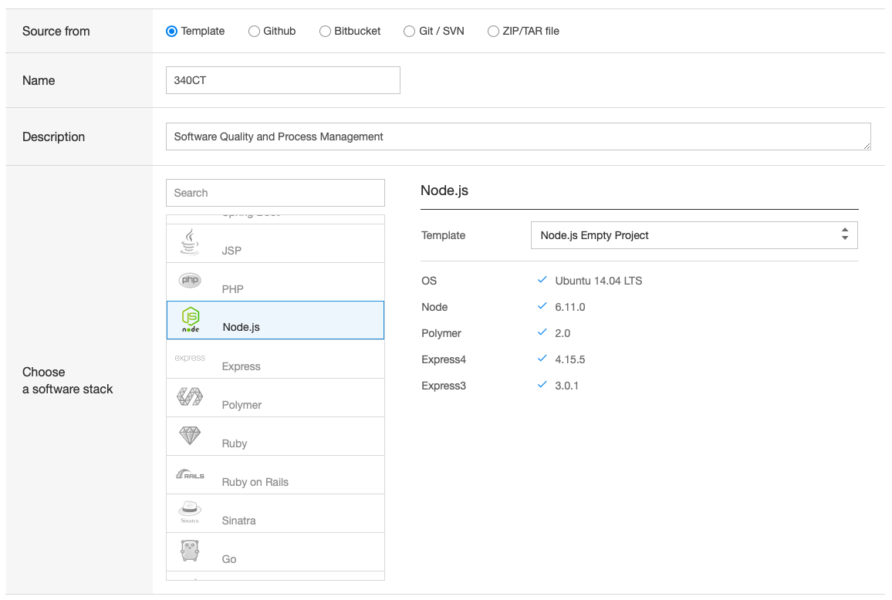
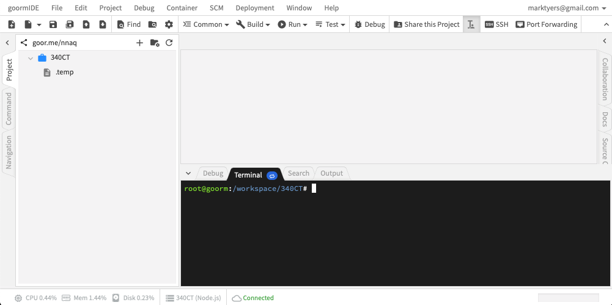
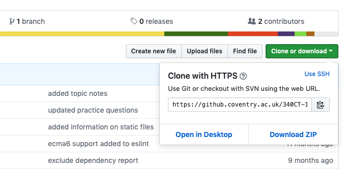
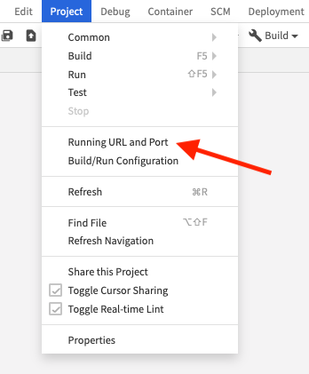
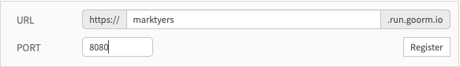
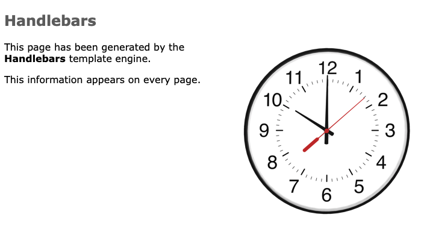

# The Goorm IDE

This is an alternative to using Codeanywhere. You need to sign up for an account on [their website](https://ide.goorm.io/), sign in and access the dashboard page. Click on the **Create a New Container** button.


You will be presented with a screen where you can name your project and choose a software stack:



You should see an IDE that displays the files down the left side with an editor in the main view and a terminal window below:



## Cloning the Lab Content

The next step is to clone the repository containing the lab materials into the IDE. Start by opening the [GitHub page](https://github.coventry.ac.uk/340CT-1819SEPJAN/TEACHING-MATERIALS). Locate the **Clone or download** button, clicking this pops open a small window as shown. Copy the URL in this window to your clipboard.



Returning to the IDE, run the following command in the terminal:

```shell
git clone https://github.coventry.ac.uk/340CT-1819SEPJAN/TEACHING-MATERIALS.git labs
```

This creates a `labs/` directory containing all the files from the repository.

By default real-time linting is enabled however this currently uses an old linter and is not ECMA6 compatible. You should disable real-time linting from the **Project** menu.

## Updating NodeJS

We can see the current version of NodeJS by running the `node -v` command. The latest version is 10.11.0 and so we need to upgrade this.

Start by installing the Node Version Manager tool:

```shell
curl -o- https://raw.githubusercontent.com/creationix/nvm/v0.33.11/install.sh | bash
```

Now click on the small blue oval on the terminal tab to reload the shell. There are lots of versions available, use the `nvm list-remote` command to see these. Install the latest using `nvm install 10.11.0` substituting the latest version number. To check the version installed use `node -v` again.

## Running an Express Server

Use the terminal to navigate to the `simple_templating` directory and try running the `index.js` script:

```shell
$ cd labs/exercises/01_nodejs/01_templates_forms/simple_templating
$ node index.js
  Error: Cannot find module 'express'
```

Notice you get an error, we need to install the missing module using the _Node Package Manager_ tool. We can then try to run the script again:

```shell
$ npm install express
$ node index.js
  Error: Cannot find module 'express-handlebars'
```

We get a different error explaining that there is another missing module:

```shell
$ npm install express-handlebars
$ node index.js
  app listening on port 8080
```

Now we have the server up and running so the final task is to view the web page using the web browser.



This will open a window where you will need to register a new URL and port:



1. Use your **University Username** as the URL segment.
2. Make sure you specify port **8080** (this is the one used by your server).

You need to set this up as your **run** configuration as shown.


The final step is to open a new browser window and enter your chosen URL, you don't need to specify the port, this was done through port-forwarding:



If you make changes to the code or want to quit the IDE you will need to stop the server. To do this, select the terminal window and press ctrl+c.
