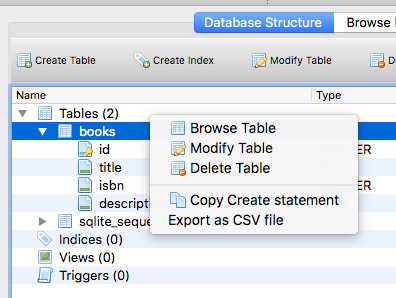
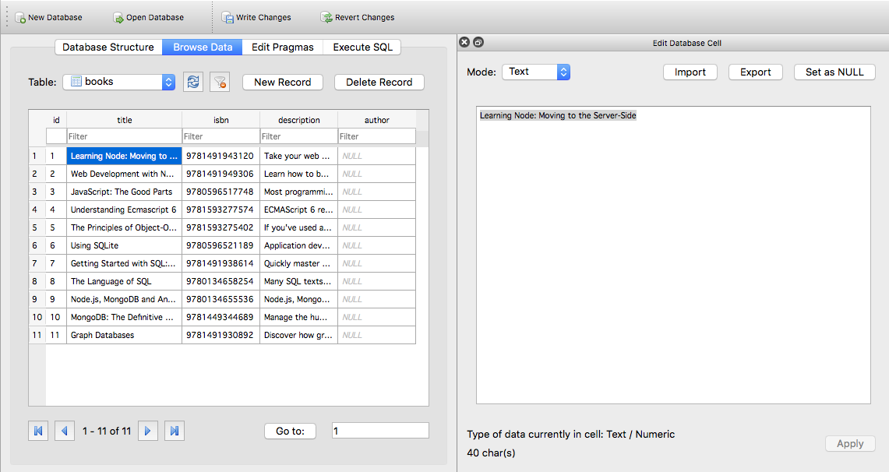

# Dynamic Websites

By this stage you are familiar with the NodeJS language and how the Express framework to deliver web pages. You have also been working with various types of data persistence such as SQLite databases. This worksheet will show you how to use this knowledge to design and build a dynamic website, that is a website that gets its content from a data source (such as a relational database).

## 1 Building SQLite Databases

In the data persistence worksheet you worked with scripts that created a new database on launch and added the tables dynamically. In a typical scenario you would want to create the database .db file and populate it with some data before running the script. Since an SQLite database is just a single binary file with a .db file extension this process is very straightforward and you can either use the commandline shell tool or choose from a number of graphical tools to make this step as easy as possible.

### 1.1 Using the Shell Tools

Start by installing the tools on your computer:

1. On MacOS, install the [Brew Package Manager](https://brew.sh/) then `$ brew install sqlite`.
2. On Ubuntu (including CodeAnywhere) it should be installed using the standard package manager:
    1. `$ sudo apt-get update`
    2. `$ sudo apt-get install sqlite3 libsqlite3-dev`
3. It a bit of a pain to install on Windows 10 but there is a good [YouTube video](https://youtu.be/zOJWL3oXDO8) that covers the process.

If you use the terminal/command prompt to navigate to the `exercises/13_website/bookshop/` directory you will find a prebuilt database called `bookshop.db`. To open a database you use the `sqlite3 bookshop.db` command. Note: if the file you specify does not exist, a new database will be created. Open the `bookshop.db` database.

Notice that the prompt changes to `sqlite>`, this means you are interacting with the `sqlite3` program. There are a number of special [commands](https://www.sqlite.org/cli.html) that include standard SQL statements as well as special sqlite commands (these start with a period/dot and are sometimes called _dotcommands_. Try the following commands (note: the up arrow recalls previous commands):

```sql
sqlite> .tables
sqlite> .schema books
sqlite> SELECT title, isbn FROM books;
sqlite> .headers on
sqlite> SELECT title, isbn FROM books;
sqlite> .mode column
sqlite> SELECT title, isbn FROM books;
sqlite> .exit
```

#### 1.1.1 Executing Complex SQL Commands

The sqlite shell works well for simple SQL statements but it is difficult to enter more complex ones. A better solution is to create a .sql file containing the commands you want to run and then importing it. There is a books.sql file in the same directory as the database. If you open this you will see an SQL INSERT statement that will add a new book to the database:

```sql
$ sqlite3 bookshop.db
sqlite> .read books.sql
sqlite> .headers on
sqlite> .mode column
sqlite> SELECT title, isbn FROM books;
sqlite> SELECT count(id) AS books FROM books;
sqlite> .exit
```

#### 1.1.2 Test Your Understanding

1. Edit the `books.sql` file so it contains 3 INSERT statements to insert an additional 2 books into the database.
2. Run this SQL on your `bookshop.db` database to insert the two book records.
3. Check that there are now 14 books in the database.

### 1.2 Using a Graphical Tool

As you have seen it is possible to work with an SQLite database using the CLI however it is not simple and straightforward, especially when inserting complex records. In this section we will be learning how to use a graphical tool called [DB Browser for SQLite](https://sqlitebrowser.org) which runs on MacOS, Linux and Windows. Note: since Codeanywhere does not suport a traditional X11 Windows GUI you won't be able to install it.

1. On MacOS and Windows 10 you can download the installer from the [main website](https://sqlitebrowser.org).
2. On Ubuntu Linux you need to [add an additional repository and install from there](https://linuxhint.com/install-sqlite-browser-ubuntu/):
    1. `sudo add-apt-repository ppa:linuxgndu/sqlitebrowser-testing`
    2. `sudo apt-get update`
    3. `sudo apt-get install sqlitebrowser`

Install and open the software then use the **Open Database** button in the toolbar to open the `bookshop.db` database.

#### 1.2.1 Modifying the Schema

Our first task is to add an author field to the database. Make sure the **Database Structure** tab is selected then right-click on the table name and choose **Modify Table**.



Use the **Add Field** button to add the `author` field which should have a type of `text`. 


Notice that it builds the correct SQL statement underneath. This is useful to learn how to use the SQL language. When you are done, click on the **OK** button.

#### 1.2.2 Browing and Editing the Data

Now we have modified the database schema we need to complete the task by adding the authors for the books in the table. You can find the list of authors in the `books.csv` file. Note: you have added two more books to the database so you will need to search for the authors data for these.

Open the **Browse Data** tab. Notice that there are two panes of information.

1. The left pane displays the records and fields currently in the selected table. You will have three additional records at this stage).
2. The right pane is for editing the currently selected database cell. if you make changes to a cell you should use the **Apply** button to save them.



Using the data in the `books.csv` file, add the authors to each of your book records.

#### 1.2.3 Test Your Understanding

1. Add two more fields to the database to store the _publisher_ and the _year_ the book was published. Make sure you choose the most appropriate data type for each.
2. Use the data in the `books.csv` file to insert the correct data. You will need to find this data for the three additional books you have added to the table.

## 2 Building a Dynamic Web Page

Now you have a working database containing some useful data you need to display this in a web page. Start by locating and running the `index.js` script in the `bookshop/` directory (you will need to install the dependencies first). Notice that there is a message in the terminal to let you know the script has connected to the database. Now view the web page, notice it displays the book titles from your database (including the ones you added).

This is known as a dynamic (or data-driven) website. By the end of this section you will have a clear understanding of how this can be created using NodeJS. Lets look at how this works. Open the `index.js` script.

1. The top of the script imports and configures the express package. This is identical to the previous scripts you have written.
2. One line 18 we import the sqlite3 package and then directly below this we create a `Database` object that points to the `bookshop.db` database we worked on earlier. The callback is triggered either when the database is connected or an error occurs.
3. Underneath this is the first of two routes. This first one `/` will be used to display a list of books.
4. the first step (on line 26) is to write an SQL statement to retrieve all the book titles and their primary keys from the `books` table. We display this in the terminal to check the syntax.
	1. Copy this SQL statement and, using either the CLI or GUI tools, run this against your database to check it works as expected.
5. Now we call the `all()` function that is part of the database (`db`) object. This takes two parameters:
	1. The SQL statement we created previously.
	2. A _callback_ function to run once the statement has been executed. This takes two parameters, an error object (null if no error) plus a data object that contains an array of JS objects containing the data returned from the query.
6. We now print the data object to the terminal. Note that it is not easy to read.
	1. Replace line 30 with `console.log(JSON.stringify(data, null, 2))`. What has changed? Can you explain why?
7. We need to convert this array into a suitable chunk of html that we can insert into the page template.
	1. We start by creating a variable and storing the opening list element.
	2. We loop through the array and for each index we take the data, wrap it in html tags and append it to the variable.
	3. Finally we append the closing list element.
8. We print this to the terminal on line 37 to check the html is correct.
9. Finally we pass this string to the `index.html` template and render it in the browser.

### 2.1 Test Your Understanding

1. Convert the html list into a 1 column html table.
2. Add and link a stylesheet to display the table clearly.
3. Modify the html to retrieve the publication year.
4. display the publication year in a second column.
5. Add a third column that displays the text `details` for each book.

## 3 Adding Search Functionality

There are not many books in our database so displaying them all is not a problem however once we increase the number of books significantly we need to find a way to filter them. In this section we will be implementing a simple search functionality. Start by opening the `index.html` template file.

1. If you look directly under the first route you will see a second route commented out (lines 42-63). Comment out the route you have been using in section 2 and uncomment this one. Restart the script.
2. Notice the route uses a different template (`newindex.html`) which contains an html form. This will display a search box and button.
3. Type in your search term `sqlite` and click on the search button, this reloads the page. You will see the search term `sqlite` remains in the text box and the page displays the books that match your search term.
	1. Click in the _address bar_ in your browser and look carefully at the URL.
	2. It ends with the string `?q=hello`.
	3. Examine the attributes in the html form element:
		1. The `action="/"` attribute tells the form to send the data to the root URL.
		2. The `method="get"` attribute tells the form to pass the data in the URL.
	4. Examine the html for the text box:
		1. The `type="text"` attribute tells the browser to display a textbox.
		2. The `name="q"` tells the form to submit the contents of the textbox as an object called `q`, this explains the string in the URL.
4. Lets examine the new routes file. This is contains all the code from the old version however you should note the key differences which will be analysed later:
	1. All the previous `console.log()` commands have been removed to avoid cluttering the terminal.
	2. The `for()` loop is now a single line so the curly braces have been removed.
	2. There is a block of new code (lines 45-52)
	3. The last line (line 60 has changed).
5. The new code block serves two purposes:
	1. It assigns a value to the `q` variable based on the query string passed in the URL (it default to a blank string).
	2. If there is a query string it replaces the previous SQL statement with one that carries out a search based on this value.
6. On line 60 the search string is passed to the page template. If you examine the html form you will see that this is used as the `value` attribute in the textbox, this is how the search string _remains_ in the search box after the search.

### 3.1 Test Your Understanding

1. You have probably noticed that the search is case-sensitive. Use the SQLite `upper()` function to make the search case-insensitive.
2. The search ignores the author, publisher and year fields, change the SQL query to include these.
3. Insert a `h2` element that displays the text `xx results for "yyy"` where xx contains the number of results found and yyy is the query. This should not be displayed at all if the search box is empty.

## 4 Passing Data Between Pages

At the moment we are only displaying some of the data for each book such as the title. If we tried to retrieve _all_ the data for _all_ the books this would take a lot longer to load and be very cluttered. The solution is to create another page to display all the data for a selected book.

Make sure the script is running and try accessing the `/details/1` route. This displays detailed information on the first book in the database (the one with the primary key `1`). What happens if you change this to `/details/2`? By passing the book id in the URL we can tell the page which book details to display. Open the `index.js` file and locate the `/details/:id` route that starts on line 65.

1. The route contains two segments:
	1. The first segment must be the string `details`.
	2. The second segment can be anything at all. This value can be accessed in the `req.params` object.
		1. Because the route defines `:id`, this is the object key it will be stored under, `req.params.id`.
	3. This value is used to build the SQL statement (line 67) which is displayed in the terminal.
2. Now we call the `all()` function that is part of the database (`db`) object. This returns a JavaScript object containing the first matching record.
	1. The callback runs after the query completes or an error occurs.
	2. If no error occurs, the entire object is displayed in the terminal and passed to the html template.
3. If you open the `details.html` template you can see the placeholder names match the database fields.

### 4.1 Linking the Pages

Now we have built the book details page we need to add hyperlinks to each book in the table. Clicking on the link will load the correct book details.

1. Locate the point where you are looping through the array of books and building the html list/table.
2. Wrap the book title in an html `a` element.
	1. The `href` attribute should point to the details page and pass the id field for the book:
	2. Here is a clue: `<a href="/details/${book.id}">${book.title}</a>`.
3. Restart the script and see if the links are displayed correctly.
4. If you click on one of these links does it load the correct book details?

### 4.2 Test Your Understanding

1. The descriptions in the database contain newline `\n` characters but these are ignored by the browser. use the `String.replace()` function to replace these with `</p><p>` so that the paragraphs are preserved.
2. You have added additional fields to the database but these are not shown. Modify the script (and the html template) to display these missing fields.
3. The _page title_ currently displays the text `Bookshop`. Change this to display the name of the book.
4. Add a back button to return to the search page.
	1. What has happened to the search filter when you go back to the previous page?
	2. You will need to pass this to the details page and pass it back when the back button is clicked.

# 5 Inserting Data

So far we our dynamic website has been working with data from the database but we have not been able to add new records to the database. In this section we will be building a form to let us add data.

To create a working form you need to have two routes:

1. The first (get) displays the form.
2. The second (post) inserts the data and then redirects back to another page.

There is already a working form. Access the `/form` route in your browser, this will display a simple html form where you can enter a book title, isbn and description. Try adding a book using this (there are some extra examples in the `books.csv` file). Notice that when you click on the add button you end up back at the list of books and the new one has been added to the end. Lets look under the bonnet to see how this has been achieved. Open the `index.js` script.

1. Towards the end of the script there is a `/form` route which sends the contents of the `form.html` file to the browser. This is how we display the form.
2. In the `form.html` file you will see that we have created a simple html form. Note:
	1. The `form` element contains a couple of important attributes:
		1. The `action="/add"` attribute directs the form to send its data to the `/add` route.
		2. The `method="post"` attribute directs the form to send its data in the message body and not in the URL.
		3. Taken together it means that the data will be sent using the POST method to the `/add` route.
	2. Each form element has a `name` attribute which defines the object key each piece of data can be found under.
3. In the `index.js` script you will see a route `app.post('/add', callback)`, it is this that will be called when the form data has been submitted.
	1. All the post data can be accessed through the `req.body` object and, on line 81 we print this to the terminal to check all the data is there.
	2. Next we use this data to build an SQL statement to insert a new record into the database.
	3. The `db.run()` function executes the SQL statement and the callback runs either on success or if there was an error.
	4. Finally, as soon as the SQL statement has run we redirect the browser back to the main page which will display all the book records including our new one.

### 5.1 Test Your Understanding

1. Modify the form to add the additional fields of data you have added to the books table (author, publisher, year).
2. Modify the `app.post('/add', callback)` to insert this additional data into the database.
3. Add a link to the home page to take the user to the new book form.
4. Add a _Cancel_ link on the form to return the user to the home page.
5. Style the table to improve its appearance and usability.
