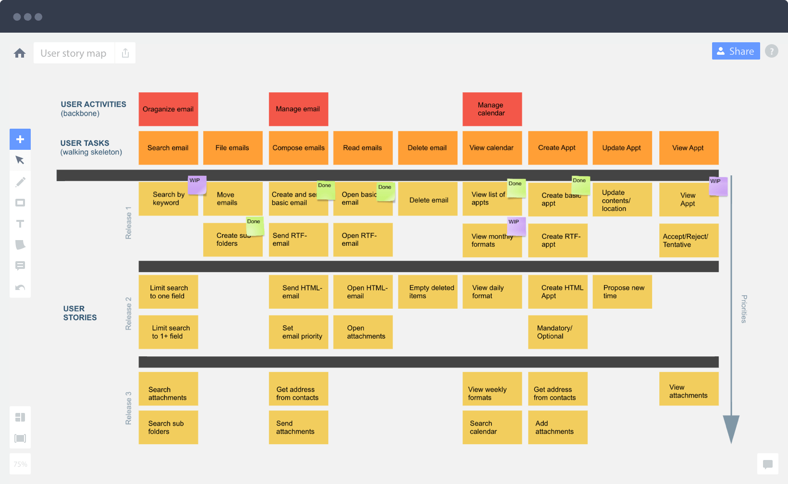

# May 2017

Coventry University

Faculty of Engineering, Environment and Computing

# 302CEM Agile Development

Instructions to candidates

Time allowed: 2 Hours 0 minutes

Answer: All Questions

 The total number of questions in this paper: 4

All questions carry equal marks

Start each question on a new page and carefully identify your answers with the correct question number

For this examination you will be supplied with the following:

1 Answer Book

You must hand this question paper in at the end of the examination

----

1. There have been many studies into the concept of 'competence'.
    1. Abraham Maslow describes four states in the progression to full competence. Define and critically analyse these _(12 marks)_
    2. Assess the role of Cognitive Bias and the Dunning-Kruger Effect when building effective agile teams _(6 marks)_
    3. Define and explain the Skills for the Information Age (SFIA) Framework and how it uses skills and levels to define competence _(7 marks)_

(Total 25 marks)

----

2. User Stories are a key tool in agile development.
    1. Jeff Patton describes a process called User Story Mapping. Critically analyse its role in improving agile development _(12 marks)_
    2. Alistair Cockburn describes the principle of Goal Levels in which user stories are placed into one of three levels. Explain the rationale behind this process and how the stories are organized _(9 marks)_
    3. Evaluate the benefits of Alternative Stories _(4 marks)_

(Total 25 marks)

----

3. Test-Driven Development is commonly employed by agile teams.
    1. Describe the principles of TDD _(5 marks)_
    2. Describe the TDD process _(12 marks)_
    3. Describe two benefits of TDD _(4 marks)_
    4. How can each module be tested in isolation? _(4 marks)_

(Total 25 marks)

----

4. Most modern software is accessed through the Cloud.
    1. What is the Cloud? _(5 marks)_
    2. Critically compare cloud vs traditional architectures showing the advantages and disadvantages of both. _(4 marks)_
    3. Compare the three types of cloud services and give an example of each. _(6 marks)_
    4. It is important that cloud services can scale to meet demand. For each of the two approaches below, explain, with the use of diagrams, how this scalability is achieved. _(10 marks)_
        1. Load balancing
        2. Clustering

(Total 25 marks)

----

# Solutions

1. There have been many studies into the concept of ‘competence’.
    1. 3 marks for each, one for name and 2 for description:
        1. Unconscious incompetence The individual does not understand or know how to do something and does not necessarily recognize the deficit. They may deny the usefulness of the skill. The individual must recognize their own incompetence, and the value of the new skill, before moving on to the next stage. The length of time an individual spends in this stage depends on the strength of the stimulus to learn.
        2. Conscious incompetence Though the individual does not understand or know how to do something, he or she does recognize the deficit, as well as the value of a new skill in addressing the deficit. The making of mistakes can be integral to the learning process at this stage.
        3. Conscious competence The individual understands or knows how to do something. However, demonstrating the skill or knowledge requires concentration. It may be broken down into steps, and there is heavy conscious involvement in executing the new skill.
        4. Unconscious competence The individual has had so much practice with a skill that it has become "second nature" and can be performed easily. As a result, the skill can be performed while executing another task. The individual may be able to teach it to others, depending upon how and when it was learned.
    2. 3 marks for each, one for name and 2 for description:
        - A cognitive bias refers to a systematic pattern of deviation from norm or rationality in judgment, whereby inferences about other people and situations may be drawn in an illogical fashion. Individuals create their own "subjective social reality" from their perception of the input.
        - The Dunning–Kruger effect is a cognitive bias in which low-ability individuals suffer from illusory superiority, mistakenly assessing their ability as much higher than it really is. Dunning and Kruger attributed this bias to a metacognitive inability of those of low ability to recognize their ineptitude and evaluate their ability accurately. Impact is that individuals defer asking for help and fail to use the most appropriate tools due to lack of knowledge and understanding.
    3. 3 marks for first point and 4 for second:
        1. The Skills Framework for the Information Age is a model for describing and managing competencies for ICT professionals for the 21st century
        2. Is intended to help match the skills of the workforce to the needs of the business.

----

2. User Stories are a key tool in agile development.
    1. 3 marks for a suitable diagram, 3 points from the list below, 3 marks for each:

        - Deliver important requirements first
        - Split requirements into small slices
        - Defer less important requirements to later release
        - Improves communication with the customer
        - Helps visualise product or system roadmap
    2. 3 from the list below, 3 marks for each:
        - Cloud, flying kite, waves, fish seabed. (3 marks)
        - More important goals are placed higher than others. (3 marks)
        - Users get lost if there are lots of goal levels.(3 marks)
    3. Users have different routes through the system. These need to be captured,
normally after the common paths. _(4 marks)_

----

3. Test-Driven Development is commonly employed by agile teams.
    1. Test-driven development (TDD) is a software development process that relies on the repetition of a very short development cycle: requirements are turned into very specific test cases, then the software is improved to pass the new tests, only. This is opposed to software development that allows software to be added that isn't proven to meet requirements. _(5 marks)_
    2. 3 marks for each of the following:
        1. Add a test: Write a test that defines a function or improvements of a function
        2. Run test so it fails: This validates that the test harness is working correctly, that the new test does not mistakenly pass without requiring any new code
        3. Write code and run test until it passes: The next step is to write some code that causes the test to pass. The new code written at this stage is not perfect
        4. Refactor code: The growing code base must be cleaned up regularly during test-driven development.
    3. Any two of the following (2 marks each):
        - TDD meant writing more tests and, in turn, programmers who wrote more tests tended to be more productive.
        - Large numbers of tests help to limit the number of defects in the code.
        - Forces code development to be modular with low coupling.
    4. How can each module be tested in isolation? (2 marks for each):
        - Ensure low coupling
        - Use mocks to improve test isolation.

----

4. Most modern software is accessed through the Cloud.
    1. Stuff you can access on the Internet rather than on your local computer. A metaphor for the Internet. Cloud services are becoming increasingly popular with organisations (5 marks).
    2. Advantages 2 marks (2) disadvantages 2 marks (4 marks total):
        - Pro: Convenience
        - Pro: Reliability
        - Con: bandwidth & capacity
        - Con: required online access
        - Con: no central body to govern
    3. mark for correct acronym mark for example (6 marks total):
        - SaaS: Software as a service – google drive or other
        - PaaS: Platform as a service – google app engine or other
        - IaaS: Infrastructure as a service – AWS or other
